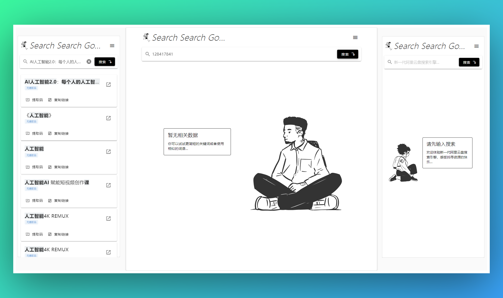

<p align="center">
  <a href="https://ssgo.app" target="blank">
    
    <h1 align="center"> SearchSearchGo-APP</h1>
  </a>
</p>

<p align="center">
  <a href="https://nuxt.com/">
    
  </a>
  <a href="https://vuetifyjs.com/">
    
  </a>
  <a href="https://www.typescriptlang.org/">
    
  </a>
  <a href="https://www.elastic.co/">
    
  </a>
  <a href="https://opensource.org/license/mit/">
    
  </a>
</p>

<p align="center">
一款极简体验、优雅、现代化、资源丰富、免费、无需登录的新一代阿里云盘搜索引擎，来体验找寻资源的快乐吧~
</p>

<p align="center">
  <a href="">
     
  </a>
</p>

## 功能特性

得益于Nuxt框架，该应用支持SSR，对SEO比较友好:

1. 比如当用户输入搜索之后，对应的url路径也会发生变化，比如[https://ssgo.app/?page=1&query=AI](https://ssgo.app/?page=1&query=AI)，
2. 如果用户将该url分享到其他平台被搜索引擎抓取之后，搜索引擎得到的数据将不再是空白的搜索框，而是包含相关资源的结果页，
3. 这样有可能再下一次用户在其他搜索引擎搜索对应资源的时候，有可能会直接跳转到该应用的搜索结果页，这样就可以大大提高该应用的曝光率。

## 开发事项

启动项目：

```shell
npm i -g pnpm
pnpm dev
```

环境变量：

|变量名|是否必需|描述|例子|
|-|-|-|-|
|ES_URL|是|ElasticSearch的地址|`http://localhost:9200`|
|ES_INDEX|是|ElasticSearch的索引|aliyunpan|
|ES_AUTH_USERNAME|否|ElasticSearch的用户名|elastic|
|ES_AUTH_PASSWORD|否|ElasticSearch的密码|changeme|

除此之外，如果你需要导入自己的Analytics，请修改`plugins/XXXAnalytics.ts`中的id为你自己的id

**重要**:

- 该仓库仅为SearchSearchGo的应用部分，无爬虫以及数据索引部分
- 如果你使用ElasticSearch-7搭建了一个搜索引擎，可以直接使用该应用进行构建
- 如果你使用的其他版本的ElasticSearch，则需安装对应版本的ElasticSearch客户端版本，并且`sever/api`部分中的相应字段可能需要修改，比如ElasticSearch-8中返回的就没有了`body`字段


## 意见反馈

如何反馈？

1. 点击上方的`Issues`选项，选择`new issues`，然后根据模板如果你想要表达的内容
2. 尽量使用图片、视频等易于理解的方式进行表达
3. 为你的问题添加一个标签
4. 请耐心等待笔者的反馈...

如果你想直接联系我，可以通过<a href="mailto:just@justin3go.com?subject=请表明您的来意">点击这里邮件联系</a>

## 声明

1. 本站链接为程序自动收集自互联网，链接跳转至官方网盘，网站本身不储存、复制、传播、控制编辑任何网盘文件，也不提供下载服务；
2. 本站遵守相关法律法规，坚决杜绝一切违规不良信息，如您发现任何涉嫌违规的网盘信息，请立即向<a href="https://terms.alicdn.com/legal-agreement/terms/suit_bu1_dingtalk/suit_bu1_dingtalk202103181300_11832.html">网盘官方网站</a>举报；
3. 本站是笔者在线作品演示网站，所有服务仅供学习交流使用，搜索引擎技术细节可以访问笔者的<a href="https://justin3go.com">个人博客</a>查找。
