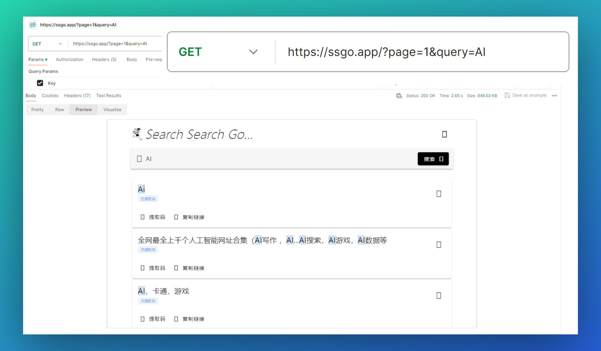
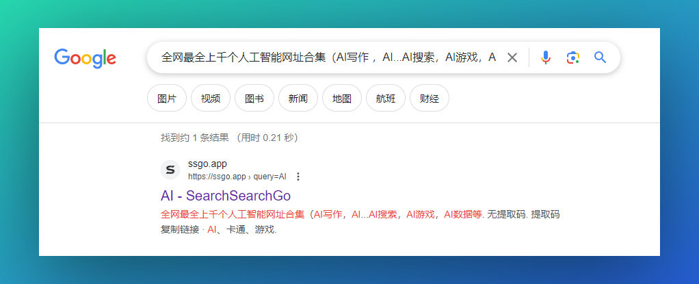
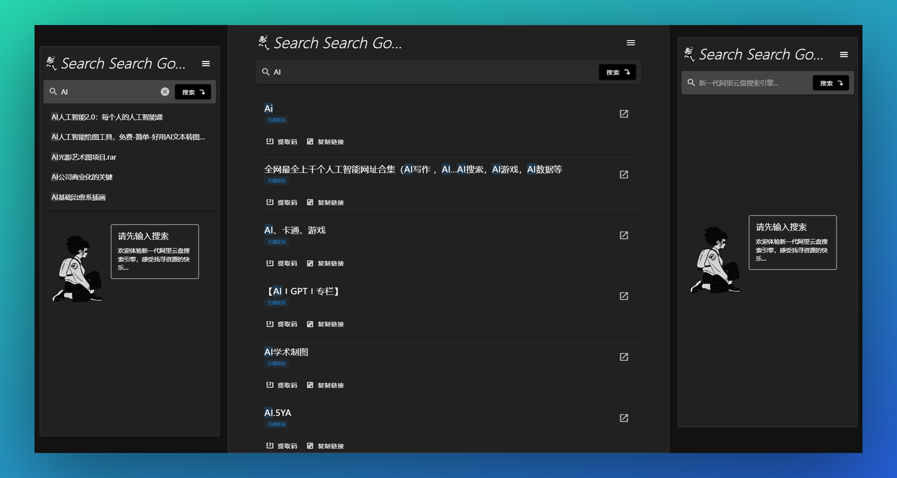

<div align="center">

<a href="https://ssgo.app" target="blank">
  
</a>

# SearchSearchGo-APP

[](https://nuxt.com/)
[](https://vuetifyjs.com/)
[](https://www.typescriptlang.org/)
[](https://www.elastic.co/)
[](https://opensource.org/license/mit/)


一款极简体验、优雅、现代化、资源丰富、免费、无需登录的新一代阿里云盘搜索引擎，来体验找寻资源的快乐吧~

每周六/周末如有更新release一次到`master`，预发布分支为`pre-release`，欢迎大家star、watch关注最新动态。


[](https://github.com/Justin3go/SearchSearchGo/pulls)
[](https://github.com/Justin3go/SearchSearchGo/issues/new/choose)
[](https://github.com/Justin3go/SearchSearchGo/issues/new/choose)


|使用vercel部署|使用docker构建|
|-|-|
|[](https://vercel.com/new/git/external?repository-url=https%3A%2F%2Fgithub.com%2FJustin3go%2FSearchSearchGo&env=ES_URL,ES_INDEX,ES_AUTH_USERNAME,ES_AUTH_PASSWORD) | [](./docs/docker.md) |

</div>


## 功能特性

`一、` **得益于Nuxt框架，该应用支持SSR，对SEO比较友好**

1. 比如当用户输入搜索之后，对应的url路径也会发生变化，比如[https://ssgo.app/?page=1&query=AI](https://ssgo.app/?page=1&query=AI)，
2. 如果用户将该url分享到其他平台被搜索引擎抓取之后，搜索引擎得到的数据将不再是空白的搜索框，而是包含相关资源的结果页，
3. 这样有可能再下一次用户在其他搜索引擎搜索对应资源的时候，有可能会直接跳转到该应用的搜索结果页，这样就可以大大提高该应用的曝光率。





`二、` **该应用支持深色模式**



`三、` **对于使用ElasticSearch7的用户，几乎是开箱即用**

[](./docs/devGuide.md)

## 开发简介

启动项目：

```shell
npm i -g pnpm
pnpm i
pnpm dev
```

环境变量：

|变量名|是否必需|描述|例子|
|-|-|-|-|
|ES_URL|是|ElasticSearch的地址|`http://localhost:9200`|
|ES_INDEX|是|ElasticSearch的索引|aliyunpan|
|ES_AUTH_USERNAME|否|ElasticSearch的用户名|elastic|
|ES_AUTH_PASSWORD|否|ElasticSearch的密码|changeme|

除此之外，如果你需要导入自己的Analytics，请修改`plugins/XXXAnalytics.ts`中的id为你自己的id

[](./docs/devGuide.md)

**重要**:

- 该仓库仅为SearchSearchGo的应用部分，无爬虫以及数据索引部分
- 如果你使用ElasticSearch-7搭建了一个搜索引擎，可以直接使用该应用进行构建
- 如果你使用的其他版本的ElasticSearch，则需安装对应版本的ElasticSearch客户端版本，并且`sever/api`部分中的相应字段可能需要修改，比如ElasticSearch-8中返回的就没有了`body`字段

## 声明

1. 本站链接为程序自动收集自互联网，链接跳转至官方网盘，网站本身不储存、复制、传播、控制编辑任何网盘文件，也不提供下载服务；
2. 本站遵守相关法律法规，坚决杜绝一切违规不良信息，如您发现任何涉嫌违规的网盘信息，请立即向[网盘官方网站](https://terms.alicdn.com/legal-agreement/terms/suit_bu1_dingtalk/suit_bu1_dingtalk202103181300_11832.html)举报；
3. 本站是笔者在线作品演示网站，所有服务仅供学习交流使用，搜索引擎技术细节可以访问笔者的[个人博客](https://justin3go.com)查找。
